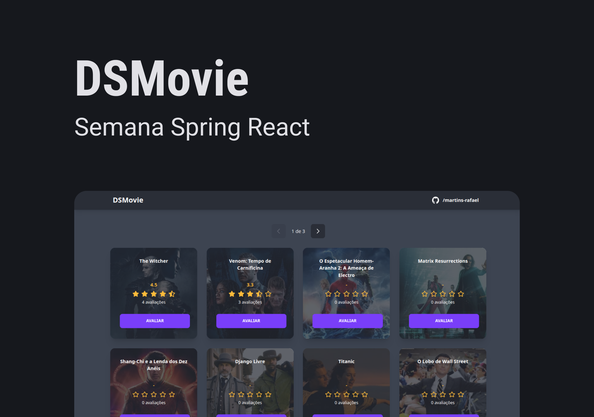
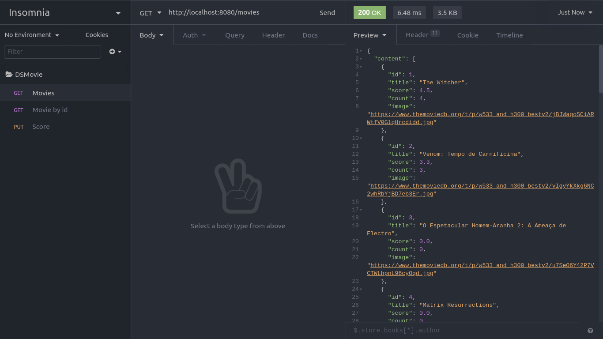

# DSmovie

<p>
  
  
  
  <a href="https://opensource.org/licenses/MIT">
    
  </a>
</p>


## Tópicos 

[Sobre o DSMovie](#sobre-o-dsmovie)

[Tecnologias](#tecnologias)

[Instalação e uso](#instalação-e-uso)

[Licença](#licença)

<br>

## Sobre o DSMovie

Projeto de app full-stack de avaliação de filmes e séries, construido em monorepo.
Desenvolvido durante a Semana Spring React do [devSuperior](https://devsuperior.com.br).

Previews:
[Vercel](https://rdcm-dsmovie.vercel.app/)
[Netlify](https://rdcm-dsmovie.netlify.app/)

<br>

<p align="center">
  
</p>

<p align="center">
  
</p>

## Tecnologias

Tecnologias e ferramentas utilizadas no desenvolvimento do projeto:

- [React](https://reactjs.org/)
- [Next.js](https://nextjs.org/)
- [TypeScript](https://www.typescriptlang.org/)
- [Next PWA](https://github.com/shadowwalker/next-pwa)
- [React Icons](https://react-icons.github.io/react-icons/)
- [Tailwind CSS](https://tailwindcss.com/)
- [DaisyUI](https://daisyui.com/)
- [Axios](https://axios-http.com/)
- [React Hook Form](https://react-hook-form.com/)
- [Yup](https://github.com/jquense/yup)
- [Java](https://www.java.com/)
- [Spring Boot](https://spring.io/)
- [H2](https://www.h2database.com/html/main.html)
- [PostgreSQL](https://www.postgresql.org/)

<br>

## Instalação e uso

### Frontend

```bash
# Abra um terminal e copie este repositório com o comando
git clone https://github.com/martins-rafael/dsmovie.git
# ou use a opção de download.

# Entre na pasta do projeto com 
cd dsmovie/frontend

# Instale as dependências
yarn install

# Rode a aplicação
yarn dev

# Acesse http://localhost:3000 no seu navegador.
```

### Backend

```bash
# Entre na pasta do projeto com 
cd dsmovie/backend

# Rode a aplicação

# Acesse http://localhost:8080/movies no seu navegador.
```

<br>


## Licença
<a href="https://opensource.org/licenses/MIT">
    
</a>

<br>

Esse projeto está sob a licença MIT. Veja o arquivo [LICENSE](/LICENSE) para mais detalhes.

---

Feito com :purple_heart: by [Rafael Martins](https://github.com/martins-rafael)

[](https://www.linkedin.com/in/rafaeldcmartins/) 
[](mailto:rafaeldcmartins@gmail.com)